[github.com/kishore1035](https://github.com/kishore1035) &nbsp;·&nbsp;
[email](mailto:pkishore530@gmail.com)

> Full-stack engineer building high-impact tools, fintech systems, and intelligent platforms. 
> Crafting sharp, reliable software over bloated abstractions.

I build fast, test against real constraints, and optimize for precision and scale. 
Currently focused on webhook resiliency, collaborative web applications, and AI-driven platforms.

<samp>typescript &nbsp; javascript &nbsp; python &nbsp; react &nbsp; next.js &nbsp; node &nbsp; express &nbsp; postgres &nbsp; fast-api &nbsp; docker &nbsp; git</samp>

**[RazorRecovery](https://github.com/kishore1035/RazorRecovery)** &nbsp;·&nbsp; <samp>typescript, next.js, webhooks</samp> 
Smart payment recovery platform built for the Razorpay Buildathon. Integrates live 
webhooks, automated retry logic, and real-time revenue leak analytics.

**[etherxsuite](https://github.com/kishore1035/etherxsuite)** &nbsp;·&nbsp; <samp>typescript, react, node</samp> 
Full-stack collaborative spreadsheet engine featuring real-time state synchronization, 
dynamic formula evaluation, and multi-format data export/import.

**[AgritechAI](https://github.com/kishore1035/AgritechAI)** &nbsp;·&nbsp; <samp>python, jupyter, machine-learning</samp> 
Agricultural intelligence platform providing crop health diagnostics, soil optimization, 
and weather predictive modeling with intelligent action recommendations.

**[Drowsiness-detector](https://github.com/kishore1035/Drowsiness-detector)** &nbsp;·&nbsp; <samp>python, opencv, dlib, computer-vision</samp> 
Autonomous real-time driver fatigue and microsleep detection system utilizing 68-point 
facial landmark telemetry, EAR/MAR metric thresholds, and active audio alarm triggers.

**[ConcertCall](https://github.com/kishore1035/ConcertCall)** &nbsp;·&nbsp; <samp>react-native, javascript</samp> 
Mobile platform designed for live music enthusiasts, real-time community sync, 
and seamless concert coordination.

Every graphic here is generated, not embedded from anyone else's server. 
`ascii.svg` is a photo pushed through a character ramp by 
[`scripts/make_portrait.py`](scripts/make_portrait.py); the stat graphics and 
these section headings are drawn by [a scheduled action](.github/workflows/stats.yml) 
straight from the GitHub GraphQL API, once a day, committing only what changed.

They animate with SMIL inside the SVG, because GitHub strips scripts from 
READMEs — and since nothing loads from a third party, nothing here can 
rate-limit or go dark. The headings are SVGs for the same reason: GitHub also 
strips CSS, so an image is the only way to put this page's own typeface on them.

The typeface is [JetBrains Mono](scripts/fonts), subset to just the characters 
each graphic draws and inlined as base64. That isn't only for looks: the 
portrait's grid assumes an advance width of exactly 0.600 em, and a viewer whose 
default monospace is narrower would otherwise see it squeezed.

Language totals cover public repositories only. `year.svg` uses the portrait's 
character ramp: `:` `+` `#` `@`, quiet to loud.
